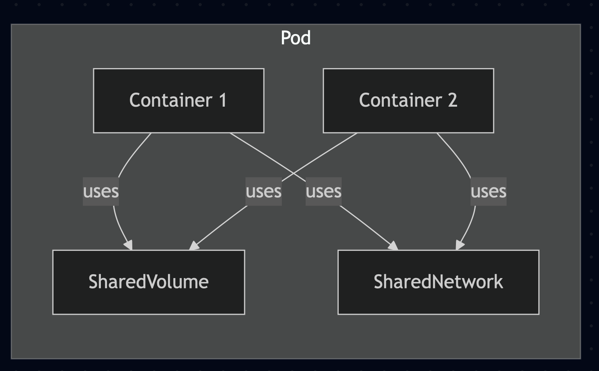
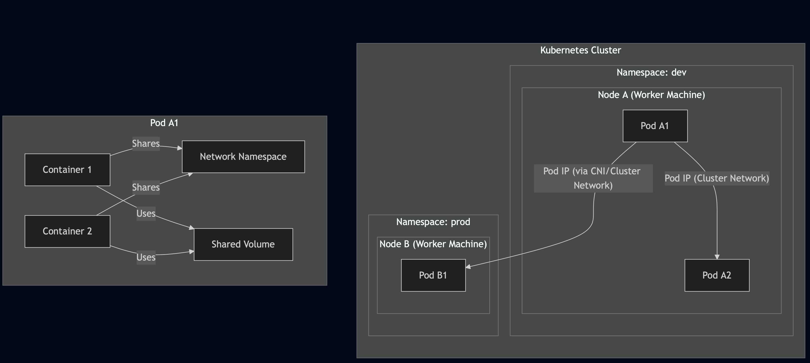

# Kubernetes Pods: Imperative vs Declarative Methods

Kubernetes Pods are the smallest deployable units in Kubernetes, encapsulating containers and shared resources. This guide demonstrates how to create Pods with custom commands and arguments using both imperative (command-line) and declarative (YAML manifest) methods.

---

## Imperative Method

Imperative commands directly instruct Kubernetes what to do, step by step.

### **1. Passing a Command at Creation**

```bash
kubectl run hello-pod --image=busybox --restart=Never --command -- echo "Hello from Kubernetes"
```

Creates a Pod named `hello-pod` that runs the command `echo "Hello from Kubernetes"`.

##### check logs and delete the pod
```bash
kubectl get po hello-pod
kubectl logs hello-pod
kubectl delete pod hello-pod
```

#### :star: **Exam Tip:** :star:

When running `kubectl delete pod`, it waits for the Pod to gracefully terminate. This can take time, especially if the Pod is running a long process or has a defined grace period.

Save time while running `delete` pod commands by using `--now` flag to delete immediately without waiting for graceful termination. or use `--grace-period=0` to skip the grace period with `--force` flag.

```bash
kubectl delete pod hello-pod --now
kubectl delete pod hello-pod --grace-period=0 --force
```


### **2. Passing a Command with Arguments**

```bash
kubectl run arg-demo --image=busybox --restart=Never --command -- printenv HOSTNAME KUBERNETES_PORT
```
##### check logs and delete the pod
```bash
kubectl get po arg-demo
kubectl logs arg-demo
kubectl delete pod arg-demo
```

Runs the `printenv` command with two arguments in the container.

### **3. Generating YAML for Review**

##### This will not work as expected! can you find out why?
```bash
kubectl run custom-cmd --image=busybox --restart=Never --command -- echo "Hi there" --dry-run=client -o yaml
```
##### check logs and delete the pod
```bash
kubectl get pod custom-cmd
kubectl logs custom-cmd
kubectl delete pod custom-cmd
```
##### Try this one instead
```bash
kubectl run custom-cmd --image=busybox --restart=Never --dry-run=client -o yaml --command -- echo 'Hi there!'
```

##### send the output to a file or apply directly. e.g.
```bash
kubectl run custom-cmd --image=busybox --restart=Never --dry-run=client -o yaml --command -- echo 'Hi there!' | kubectl apply -f - 
```

##### check logs and delete the pod
```bash
kubectl logs custom-cmd
kubectl delete pod custom-cmd
```

Preview or save the manifest for declarative use.

---

## Declarative Method

Declarative configuration uses YAML manifests to describe the desired state. Kubernetes ensures the cluster matches your specification.

### **1. Pod with Command and Arguments (YAML)**

Use command to generate YAML file e.g.
```bash
kubectl run command-demo --image=debian --restart=OnFailure --dry-run=client -o yaml --command -- printenv HOSTNAME KUBERNETES_PORT > command-demo.yaml
```
or Write the YAML by hand e.g.

```yaml
apiVersion: v1
kind: Pod
metadata:
  name: command-demo
spec:
  containers:
  - name: command-demo-container
    image: debian
    command: ["printenv"]
    args: ["HOSTNAME", "KUBERNETES_PORT"]
  restartPolicy: OnFailure
```

Defines a Pod that runs `printenv` with two arguments.

Possible Values for `restartPolicy` are `Always`, `OnFailure`, `Never`

##### How `restartPolicy` Works?
* The policy applies to all app and [*init containers*](https://kubernetes.io/docs/concepts/workloads/pods/init-containers/) within the Pod. 
* [*Sidecar containers*](https://kubernetes.io/docs/concepts/workloads/pods/sidecar-containers/) (such as logging agents) may have their own behavior, but generally, the Pod-level `restartPolicy` governs restarts for all containers except sidecars.

* If not explicitly set, the `default` is `Always` for **Pods managed by controllers like Deployments**, and **Never** for **Pods created directly** (e.g., with kubectl run --restart=Never).
* When a container restarts, Kubernetes uses an exponential backoff strategy (10s, 20s, 40s, up to a max of 5 minutes) to avoid rapid, repeated restarts
* [Read more on it here](https://kubernetes.io/docs/concepts/workloads/pods/pod-lifecycle/)

### **2. Pod with a Simple Echo Command**

```yaml
apiVersion: v1
kind: Pod
metadata:
  name: echo-demo
spec:
  containers:
  - name: echo-container
    image: busybox
    command: ["echo", "Hello from YAML"]
  restartPolicy: Never
```

Runs `echo "Hello from YAML"` as the main process.

### **3. Pod with Command as Array**

```yaml
apiVersion: v1
kind: Pod
metadata:
  name: nginx-hello
spec:
  containers:
  - name: pod
    image: nginx
    command: ["echo", "Hello", "World"]
```

Shows the command defined as an array, recommended for complex commands.

---

## Summary Table

| Method | How to Specify Command/Args | Example Syntax/Manifest | Use Case |
| :-- | :-- | :-- | :-- |
| Imperative | Inline in kubectl command | `kubectl run ... --command -- <cmd> <arg1> <arg2>` | Quick tests, ad-hoc tasks |
| Declarative | In YAML under `command` and `args` | `command: ["printenv"]`, `args: ["HOSTNAME", "PORT"]` | Version control, reproducible |


---

## Key Differences

- **Imperative:**
    - You tell Kubernetes *how* to do something right now.
    - Good for quick, ad-hoc changes or experimentation.
    - Not easily version-controlled or reviewed.
- **Declarative:**
    - You tell Kubernetes *what* the end result should be.
    - Ideal for production and infrastructure-as-code workflows.
    - Enables version control, code review, and reproducibility.

For more details, see the [Kubernetes documentation on Pods](https://kubernetes.io/docs/concepts/workloads/pods/) and [kubectl run documentation](https://kubernetes.io/docs/reference/generated/kubectl/kubectl-commands#run).

---

## Tips

- The `--command` flag in imperative mode ensures everything after it is treated as the command and its arguments.
- In YAML, `command` maps to Docker's `ENTRYPOINT`, and `args` to `CMD`.
- Use `kubectl logs <pod>` to see output for ephemeral Pods running commands.

---

## Visualization

Interested in visualizing Kubernetes objects or workflows? Try tools like [Mermaid Live Editor](https://mermaid.live/) or [ikalas.com](https://ikalas.com/) for diagramming and graph-based representations.

### Example of pod diagram using `Mermaid Live Editor`
```
flowchart TD
    %% Namespaces and Pods
    subgraph "Kubernetes Cluster"
        direction TB
        subgraph "Namespace: dev"
            subgraph "Node A (Worker Machine)"
                PodA1["Pod A1"]
                PodA2["Pod A2"]
            end
        end
        subgraph "Namespace: prod"
            subgraph "Node B (Worker Machine)"
                PodB1["Pod B1"]
            end
        end
    end

    %% Show Pod structure inside a machine
    subgraph "Pod A1"
        direction LR
        C1A1["Container 1"]
        C2A1["Container 2"]
        NetA1["Network Namespace"]
        VolA1["Shared Volume"]
        C1A1 -- Shares --> NetA1
        C2A1 -- Shares --> NetA1
        C1A1 -- Uses --> VolA1
        C2A1 -- Uses --> VolA1
    end

    %% Pod-to-Pod communication on the same node
    PodA1 -- "Pod IP (Cluster Network)" --> PodA2

    %% Pod-to-Pod communication across nodes
    PodA1 -- "Pod IP (via CNI/Cluster Network)" --> PodB1
```

#### What does a pod look like?


#### How do Pods communicate with each other?

