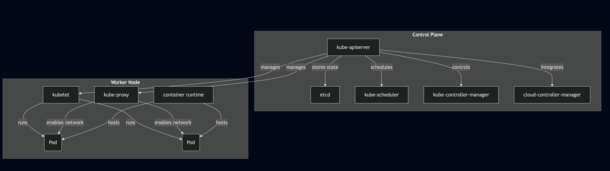

# Kubernetes Architecture Overview

Welcome to the Kubernetes Show! This guide provides a concise overview of Kubernetes architecture, focusing on the foundational concepts and components you need to understand for the CKA exam and real-world cluster administration.

---

## Why Learn Kubernetes Architecture?

Understanding Kubernetes architecture is essential for:
- Passing the Certified Kubernetes Administrator (CKA) exam (cluster architecture, installation, and configuration make up 25% of the exam)
- Effectively deploying, managing, and troubleshooting clusters in production
- Building a strong foundation for advanced Kubernetes topics

---

## CKA Exam Structure (Relevant Percentages)

- **Cluster Architecture, Installation & Configuration:** 25%
- **Workload Scheduling:** 15%
- **Service & Networking:** 20%
- **Storage:** 10%
- **Troubleshooting:** 30%

---

## Key Kubernetes Concepts

### 1. **Cluster Components**

A Kubernetes cluster consists of a **control plane** and multiple **worker nodes**:

#### **Control Plane Components**
- **kube-apiserver:** The front-end for the Kubernetes control plane. All requests (kubectl, internal, external) go through the API server.
- **etcd:** The consistent and highly-available key-value store used as Kubernetes’ backing store for all cluster data.
- **kube-scheduler:** Assigns Pods to nodes based on resource availability and scheduling policies.
- **kube-controller-manager:** Runs controller processes (e.g., node controller, replication controller) that regulate the state of the system.
- **cloud-controller-manager:** Integrates with cloud provider APIs for managing cloud-specific resources (if running in the cloud).

#### **Node Components**
- **kubelet:** An agent that runs on every node, responsible for running containers and reporting node health to the control plane.
- **kube-proxy:** Maintains network rules on nodes, enabling Pod-to-Pod communication and service abstraction.
- **Container Runtime:** Software responsible for running containers (e.g., containerd, Docker, CRI-O).

---

### 2. **Cluster Communication and Security**

- All communication between control plane components and nodes is secured using **certificates** and **PKI (Public Key Infrastructure)**.
- Certificates are stored in `/etc/kubernetes/pki` on control plane nodes.
- Each component (API server, kubelet, etcd, etc.) has its own key/certificate pair for authentication and encryption.

---

### 3. **Kubernetes Configuration**

- The main configuration file for cluster access is `~/.kube/config`.
- This file stores information about clusters, users, and contexts.
- You can use the `KUBECONFIG` environment variable to specify alternate or multiple config files.

#### Example Commands:
```


# View current kubeconfig

kubectl config view

# Switch context

kubectl config use-context <context-name>

```

---

### 4. **Static Pods**

- Critical control plane components (like etcd, kube-apiserver) are often deployed as **static Pods**.
- Static Pod manifests are stored in `/etc/kubernetes/manifests/`.
- The kubelet monitors this directory and ensures the defined Pods are always running.

---

### 5. **Hands-On Tips for the CKA Exam**

- **Know the documentation:** You will have access to the official Kubernetes docs during the exam. Practice navigating them efficiently.
- **Use kubectl aliases and autocomplete:** Save time by setting up command-line shortcuts and tab completion.
- **Familiarize with cluster config and troubleshooting:** Understand how to inspect and modify kubeconfig, view logs, and debug Pods and nodes.

---

## Visual Summary

Interested in visualizing Kubernetes objects or workflows? Try tools like [Mermaid Live Editor](https://mermaid.live/) or [ikalas.com](https://ikalas.com/) for diagramming and graph-based representations.

### Architecture diagram using `Mermaid Live Editor`

```

graph TD
subgraph Control Plane
APIServer[kube-apiserver]
Etcd[etcd]
Scheduler[kube-scheduler]
ControllerManager[kube-controller-manager]
CloudControllerManager[cloud-controller-manager]
end
subgraph Worker Node
Kubelet[kubelet]
KubeProxy[kube-proxy]
ContainerRuntime[container runtime]
Pod1(Pod)
Pod2(Pod)
end
APIServer -- manages --> Kubelet
APIServer -- manages --> KubeProxy
APIServer -- stores state --> Etcd
APIServer -- schedules --> Scheduler
APIServer -- controls --> ControllerManager
APIServer -- integrates --> CloudControllerManager
Kubelet -- runs --> Pod1
Kubelet -- runs --> Pod2
KubeProxy -- enables network --> Pod1
KubeProxy -- enables network --> Pod2
ContainerRuntime -- hosts --> Pod1
ContainerRuntime -- hosts --> Pod2

```

#### Visual Represenation of K8S


#### Antoher view of Kubernetes Architecture

---

## Additional Resources

- [Kubernetes Official Documentation](https://kubernetes.io/docs/home/)
- [CKA Curriculum](https://github.com/cncf/curriculum/blob/master/CKA_Curriculum_v1.32.pdf)


---

**Next Steps:**  
Move on to hands-on practice with Pods, Deployments, and core Kubernetes objects to solidify your understanding of the architecture!

Continue learning by following [The Kubernetes Show GitHub Repository for Free CKA Exam - Course](https://github.com/The-Kubernetes-Show/kubernetes/blob/main/Certified_Kubernetes_Administrator_CKA_Exam.md)
