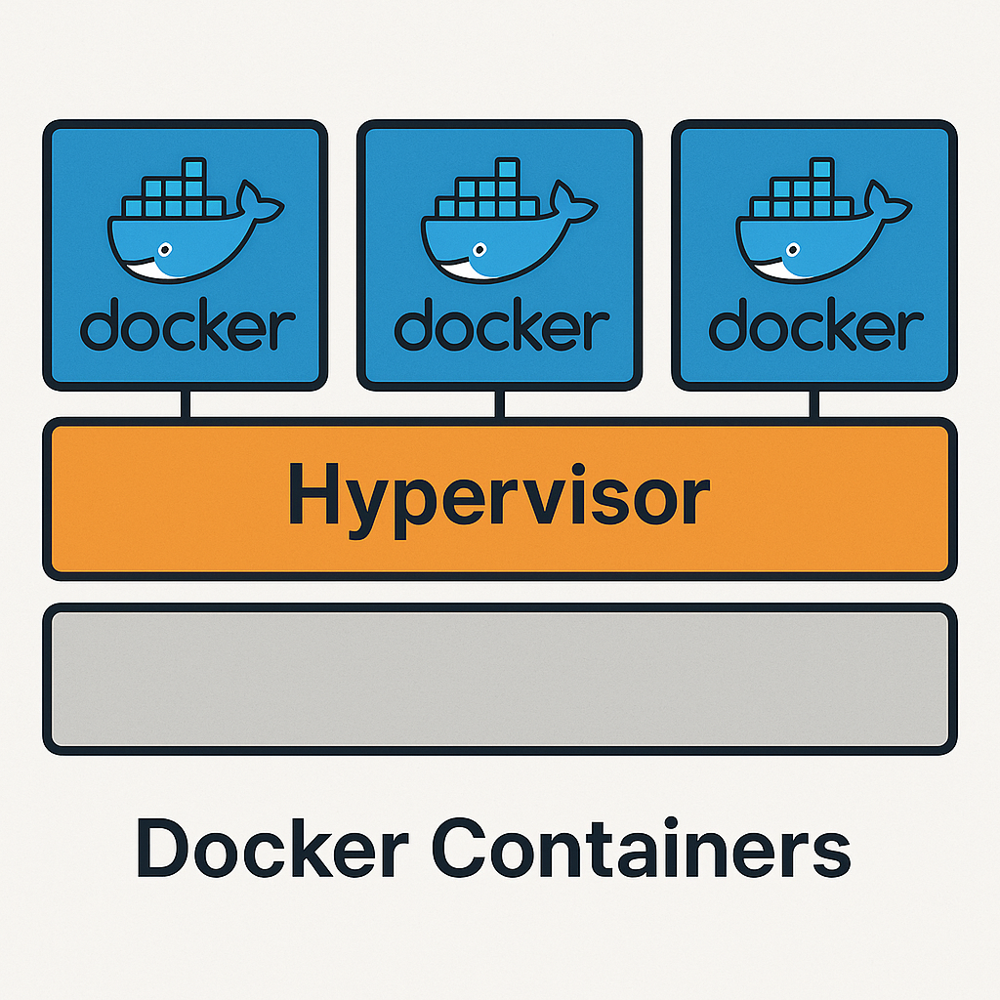
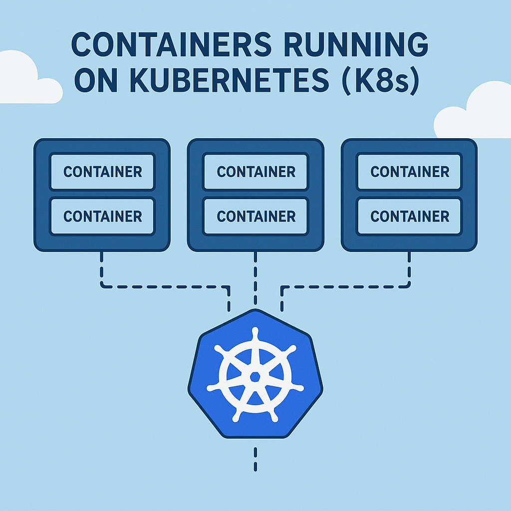

# History of Computing, Virtualization, and Containers
#### [YouTube video link](https://youtu.be/kKfLotzx-Cs)

## History of Computing
The history of computing dates back to the early mechanical calculators of the 17th century, evolving into programmable machines in the mid-20th century. The invention of the transistor in 1947 and the development of integrated circuits in the 1960s revolutionized computing, leading to the creation of personal computers, the internet, and modern cloud computing.

## Virtualization
Virtualization emerged in the 1960s with IBM's mainframe systems, allowing multiple operating systems to run on a single physical machine. It became mainstream in the 2000s with the rise of x86 virtualization, enabling efficient resource utilization and scalability.

### Types of Virtualization
1. **Hardware Virtualization**: Simulates physical hardware to run multiple operating systems.
2. **Operating System Virtualization**: Isolates applications within containers on a single OS.
3. **Network Virtualization**: Abstracts network resources for flexibility and scalability.
4. **Storage Virtualization**: Combines multiple storage devices into a single logical unit.

### Types of Hypervisors
1. **Type 1 (Bare-Metal)**: Runs directly on hardware (e.g., VMware ESXi, Microsoft Hyper-V). 
2. **Type 2 (Hosted)**: Runs on a host operating system (e.g., Qemu, VirtualBox, VMware Workstation).

## Containers
Containers, popularized by Docker in 2013, are lightweight, portable units that package applications and their dependencies. Unlike virtual machines, containers share the host OS kernel, making them faster and more efficient. They are widely used in modern DevOps workflows and microservices architectures.

## Kubernetes
Kubernetes, originally developed by Google and released as an open-source project in 2014, is a container orchestration platform designed to automate the deployment, scaling, and management of containerized applications. It was inspired by Google's internal cluster management system, Borg, and has since become the de facto standard for managing containerized workloads in cloud-native environments.

## Kubernetes Architecture

## References

- [History of Computing](https://en.wikipedia.org/wiki/History_of_computing)
- [Transistor](https://en.wikipedia.org/wiki/Transistor)
- [Integrated Circuit](https://en.wikipedia.org/wiki/Integrated_circuit)
- [Virtualization](https://en.wikipedia.org/wiki/Virtualization)
- [IBM Mainframe](https://en.wikipedia.org/wiki/IBM_mainframe)
- [x86 Virtualization](https://en.wikipedia.org/wiki/X86_virtualization)
- [Hypervisor](https://en.wikipedia.org/wiki/Hypervisor)
- [VMware ESXi](https://www.vmware.com/products/esxi-and-esx.html)
- [Microsoft Hyper-V](https://learn.microsoft.com/en-us/virtualization/hyper-v-on-windows/)
- [Qemu](https://www.qemu.org/)
- [VirtualBox](https://www.virtualbox.org/)
- [VMware Workstation](https://www.vmware.com/products/workstation-pro.html)
- [Docker](https://www.docker.com/)
- [Dockerfile](https://docs.docker.com/reference/dockerfile/)
- [Kubernetes](https://kubernetes.io/)
- [Google Borg](https://en.wikipedia.org/wiki/Borg_(cluster_manager))
- [Cloud-Native Computing](https://www.cncf.io/)
- [eBPF](https://ebpf.io/what-is-ebpf/)
- [CSI](https://kubernetes.io/blog/2019/01/15/container-storage-interface-ga/)
- [CNI](https://kubernetes.io/docs/concepts/extend-kubernetes/compute-storage-net/network-plugins/)
- [CRI-O](https://github.com/cri-o/cri-o/tree/main)
